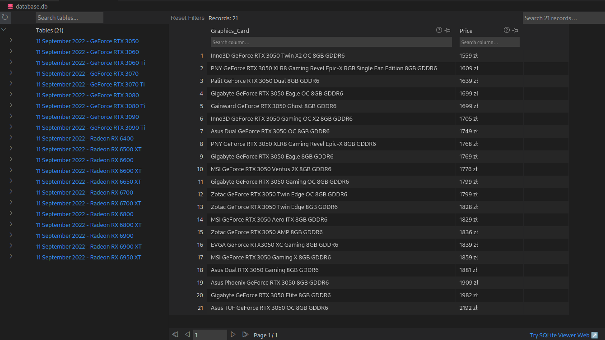

Just a small project that lets me practise OOP and navigating through websites using Selenium library. For now, it allows filtering, sorting, scraping names and prices of multiple Graphics Card models from one of the most popular polish online PC store. Names and prices are then stored in corresponding tables of SQLite3 database. Planning to expand the project by including other online PC stores and then probably plotting some charts with use of Matplotlib. That's how results look now:

